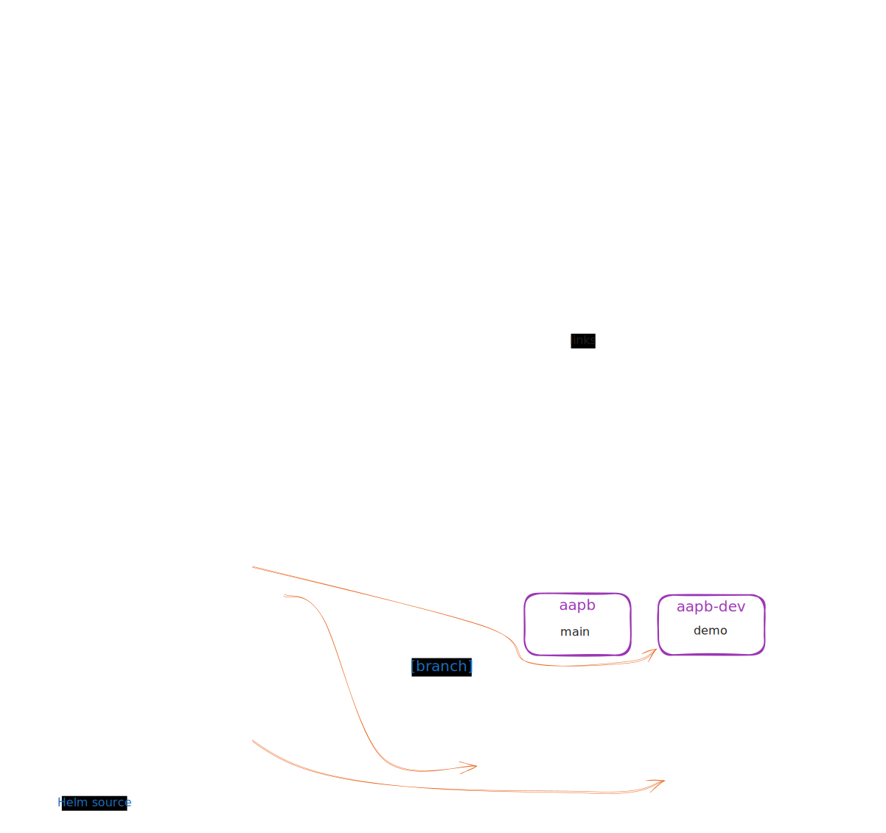

# Architecture

This section provides a high-level overview of the architecture of the AAPB application, including its components and how they interact with each other.

## Deployment

The AAPB application is deployed on a Kubernetes cluster using Helm charts for package management and Argo CD for continuous deployment.

## GitOps

The following diagram illustrates the GitOps architecture of the AAPB application:

