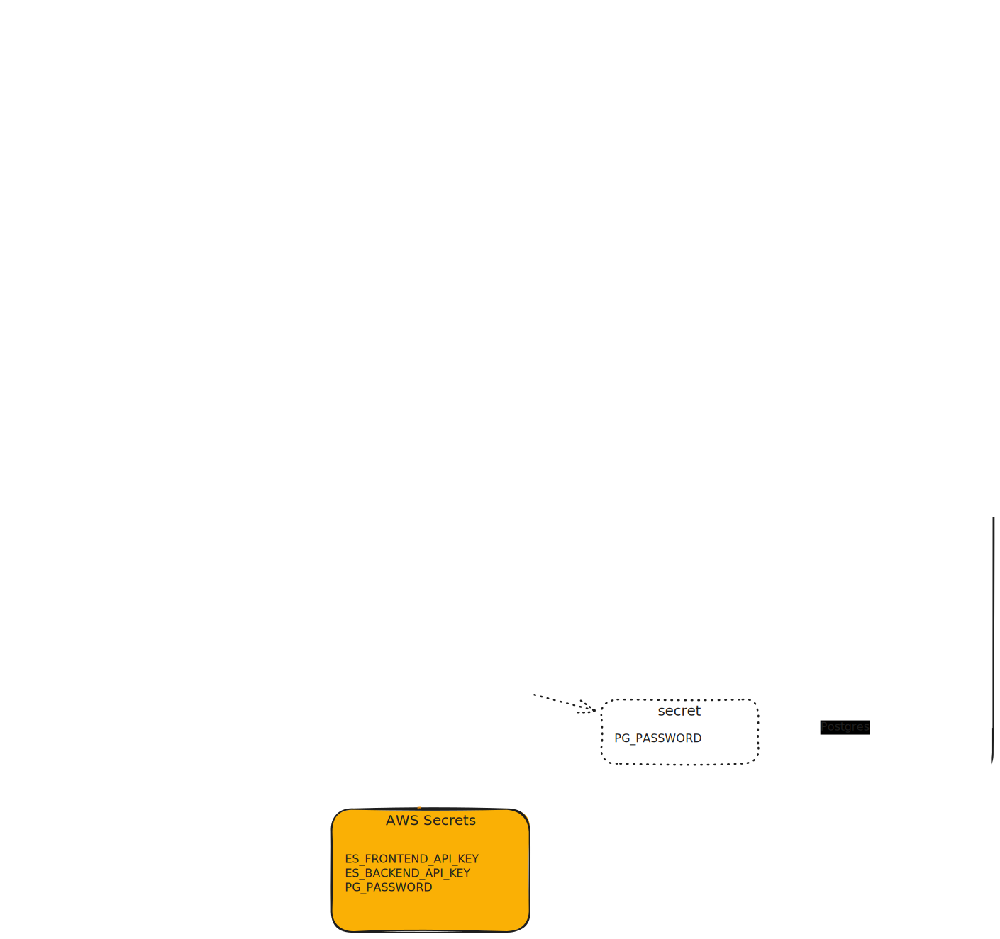

# Architecture

This section provides a high-level overview of the architecture of the AAPB application, including its components and how they interact with each other.

## Deployment

The AAPB application is deployed on a Kubernetes cluster using Helm charts for package management and Argo CD for continuous deployment.

The following diagram illustrates the kubernetes architecture of a single AAPB instance:

For installation instructions, see the [Quickstart Guide](../tutorials/quickstart.md).

## GitOps
Deployments are managed using a GitOps strategy, with Argo CD Applications.

The following diagram illustrates the GitOps architecture of the [aapb-deploy repository](https://github.com/WGBH-MLA/aapb-deploy/):

