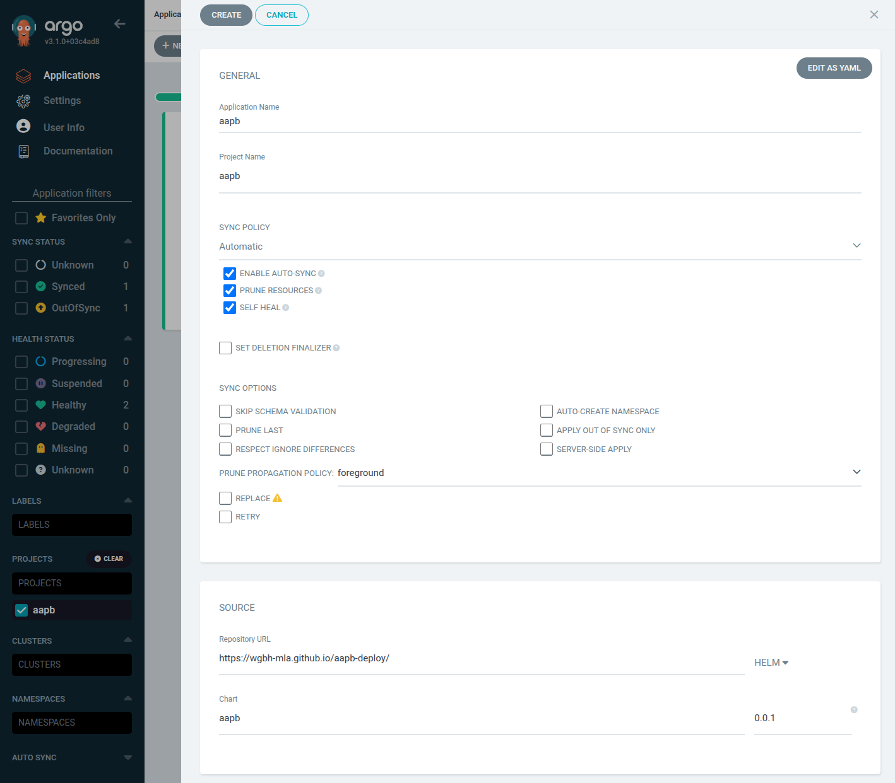

# Quickstart
This guide provides a quick overview of how to deploy the AAPB (American Archive of Public Broadcasting) application.

For an overview of the application architecture and GitOps structure, see the [Architecture Overview](../about/architecture.md).

There are two main ways to deploy the AAPB application:
1. Using Argo CD (recommended)
2. Using Helm

???+ Prerequisites
    These instructions assume you have a working Kubernetes cluster and admin access to it.
    
    The `kubectl` commands can be adapted for use with `k9s` or any other Kubernetes management tool.


??? kube "Namespaces"
    Creating a namespace is optional but recommended to keep resources organized and separated from other applications.

    This also allows you to easily uninstall the application and all its resources by simply deleting the namespace.

    ### Create a namespace
    Create a new namespace, in this case: `aapb`:

    ```bash
    kubectl create namespace aapb
    ```

    Set the current context to the new namespace:
    ```bash
    kubectl config set-context --current --namespace=aapb
    ```

    Verify the current context
    ```bash
    kubectl config view --minify | grep namespace:
    ```

## Install with Argo CD (Recommended)

1. Login to the Argo CD web interface: [cd.dev.wgbh-mla.org](https://cd.dev.wgbh-mla.org)
1. Create a new application in Argo CD with the following settings:
    - **Application Name**: `aapb`
    - **Project**: `aapb`
    - **Sync Policy**: Automatic
    - **Repo URL**: `https://wgbh-mla.github.io/aapb-deploy/`
      - Make sure to select `Helm` as the type, not `Git`
    - **Target Revision**: Use the latest helm chart version
    - **Chart**: `aapb`
1. Set other options for your deployment like **Cluster** and **Namespace**
1. Click **Create** to deploy the application



The application will be deployed automatically. You can monitor the progress in the Argo CD web interface.

## Install with  Helm
Installing the AAPB application using Helm is straightforward. Follow the steps below:


### Add Helm Repository
Add the Helm repository for the AAPB application:
```bash
helm repo add aapb https://wgbh-mla.github.io/aapb-deploy/
helm repo update
```

### Install the Application
Install the AAPB application using Helm:
```bash
helm install aapb aapb/aapb -n aapb
```
