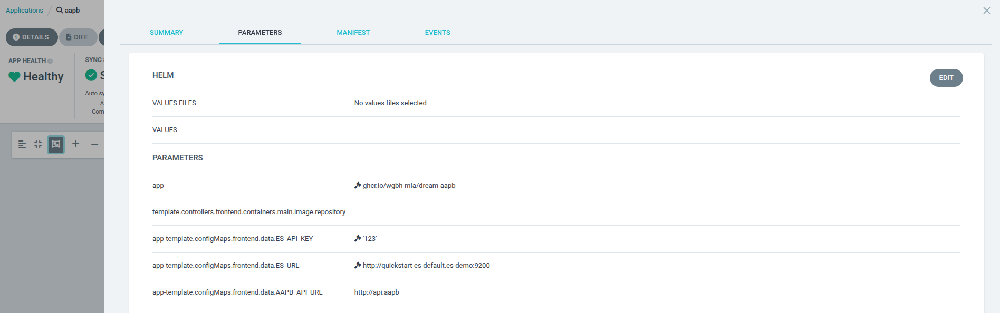

# Argo CD
Deployments are managed via [Argo CD](https://argo-cd.readthedocs.io/en/stable/), a declarative, GitOps continuous delivery tool for Kubernetes.

## Links
- [cd.dev.wgbh-mla.org/](https://cd.dev.wgbh-mla.org/) - Dev cluster
- ~~[cd.wgbh-mla.org/](https://cd.wgbh-mla.org/) - Prod cluster~~ (not yet set up)

??? kube "Admin Access"

    Access to the Argo CD web interface is restricted. Contact the WGBH Archives team for access.

    ```sh
    # Get the initial admin password
    kubectl -n argo-cd get secret argocd-initial-admin-secret -o json | jq -r .data.password | base64 -d
    ```

## Deploying a new image
### Case 1: Restart deployment
If the new image has the same tag as the previous image (e.g. `latest`), restart the deployment to pull the new image.

### Case 2: Update image tag
If the new image has a different tag, update the image tag value in the ArgoCD web interface.

### Case 3: Update image repository
If the new image is in a different repository, update the image repository parameter in the ArgoCD web interface.

## Updating Parameters
In addition to the image tag and repository, other parameters can be modified under the [Parameters tab](https://cd.dev.wgbh-mla.org/applications/argo-cd/aapb?view=tree&resource=&node=argoproj.io%2FApplication%2Fargo-cd%2Faapb%2F0&tab=parameters) in the ArgoCD web interface. These parameters correspond to the values in the Helm chart's `values.yaml` file.


