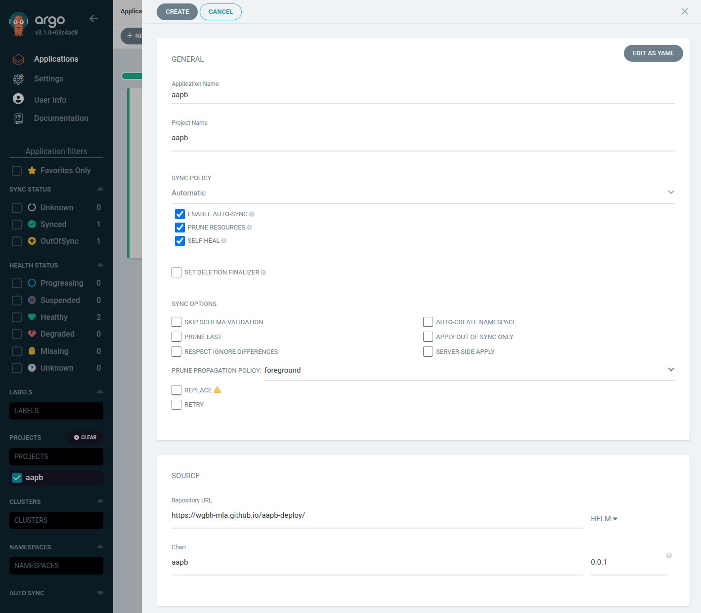

# Quickstart

## Prerequisites
These instructions assume you have a working Kubernetes cluster and `kubectl`, configured to connect to your cluster.

There are two main ways to deploy the AAPB application:
1. Using Argo CD (recommended)
2. Using Helm

## Argo CD (Recommended)

1. Login to the Argo CD web interface: [cd.dev.wgbh-mla.org](https://cd.dev.wgbh-mla.org)
2. Create a new application in Argo CD with the following settings:
   - **Application Name**: `aapb`
   - **Project**: `aapb`
   - **Sync Policy**: Automatic
   - **Repo URL**: `https://wgbh-mla.github.io/aapb-deploy/`
     - Make sure to select `Helm` as the type, not `Git`
   - **Target Revision**: Use the latest helm chart version
   - **Chart**: `aapb`



3. Set other options for your deployment like **Cluster** and **Namespace**


## Helm

### Add Helm Repository
Add the Helm repository for the AAPB application:
```bash
helm repo add aapb https://wgbh-mla.github.io/aapb-deploy/
helm repo update
```

??? kube "Namespaces"

    ### Create a namespace
    Create a new namespace, in this case: `aapb`:

    ```bash
    kubectl create namespace aapb
    ```

    Set the current context to the new namespace:
    ```bash
    kubectl config set-context --current --namespace=aapb

    # Verify the current context
    kubectl config view --minify | grep namespace:
    ```


### Install the Application
Install the AAPB application using Helm:
```bash
helm install aapb aapb/aapb -n aapb
```
